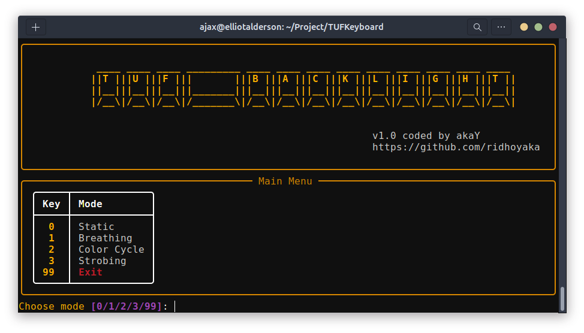

# TUF Backlight

**TUF Backlight** is a lightweight **CLI** tool designed to control **ASUS TUF keyboard RGB backlight** on **Linux systems**.
It provides an intuitive, menu-driven interface for adjusting lighting modes, colors, and effects directly from the terminal, using the official **Linux SysFS interface**.
**Built with Python and Rich**, this tool focuses on simplicity, safety, and a clean user experience without relying on desktop environments or graphical applications.

---

## Features

- Control backlight modes:
  - Static
  - Breathing
  - Color Cycle
  - Strobing
- RGB color adjustment (0–255)
- Speed control (Slow / Medium / Fast)
- Safe to use (writes directly to the official Linux SysFS interface)

---

## System Requirements

### Hardware
- ASUS TUF laptop with RGB keyboard support
- ASUS keyboard driver available in the Linux kernel
- How to check the driver :
```bash
ls /sys/class/leds/ | grep asus
```
It should display :
```bash
asus::kbd_backlight
```

### Operating System
- Linux
- Distro :
  - Ubuntu
  - Debian
  - Arch Linux
  - Fedora
  - Linux Mint
  - dll
- Desktop Environment :
  - GNOME
  - KDE
  - XFCE
  - i3
  - Cinnamon

### Software
- Python **3.8+**
- Kernel Linux **≥ 5.15** (recommended 6.x)

---

## Dependencies

- **Python 3**
- **Python module: Rich**
- **Figlet**
- **Figlet font: smkeyboard**

---

## Installation Guide

```bash
git clone https://github.com/ridhoyaka/tuf-backlight.git
cd tuf-backlight
chmod +x tufbacklight.py
pip3 install rich
sudo apt install figlet
sudo wget http://www.figlet.org/fonts/smkeyboard.flf
```

---

## Usage

```bash
sudo ./tufbacklight.py
```

---

## Screenshot



---

## Tested on

- Ubuntu 24.04
- Gnome 46.0
- Asus TUF F15 FX507ZC4

---

## License

MIT License
Free to use, modify, and distribute.

---

## Author

Akay
GitHub: https://github.com/ridhoyaka

---

## Credits

Python
Rich library
Linux kernel ASUS WMI
figlet & figlet-fonts
